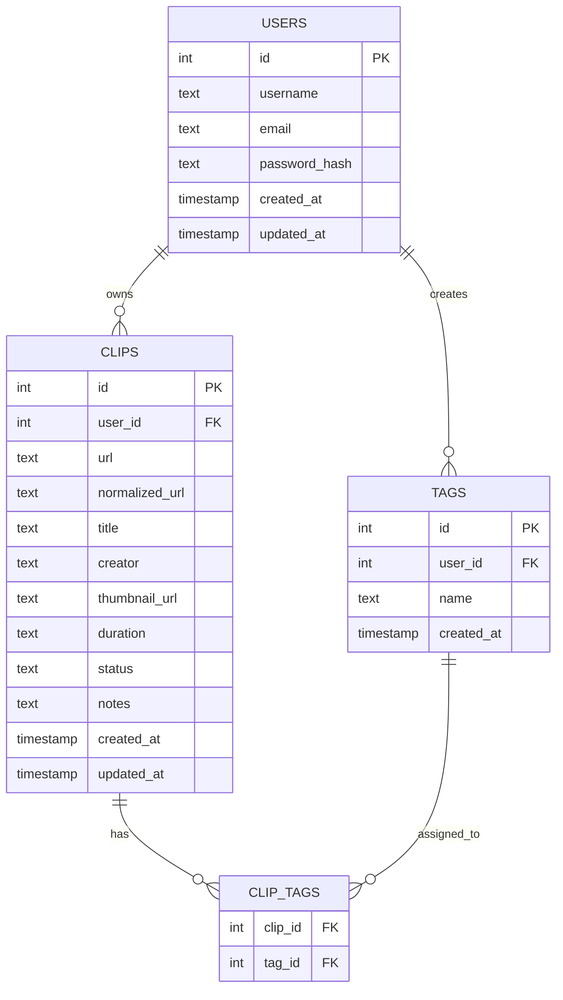

# ClipVault Database Model

## Project Summary

ClipVault is a full-stack media URL organizer. Users can save video links, organize them with statuses and tags, add notes, and prevent the same URL from being saved more than once.

The database needs to store:

- User accounts
- Saved clips
- Tags/categories
- Relationships between clips and tags

---

## Database Type

This project will use a relational database.

Planned database:

- PostgreSQL

PostgreSQL is a good fit because the application has clear relationships:

- One user can have many clips.
- One clip belongs to one user.
- One clip can have many tags.
- One tag can belong to many clips.

---

## Main Models

The main database models are:

1. `users`
2. `clips`
3. `tags`
4. `clip_tags`

---

# 1. Users Table

## Purpose

Stores account information for each user.

A user can have many saved clips.

## Fields

| Field | Type | Notes |
| --- | --- | --- |
| `id` | `SERIAL PRIMARY KEY` | Unique user ID |
| `username` | `TEXT UNIQUE NOT NULL` | User's display/login name |
| `email` | `TEXT UNIQUE NOT NULL` | User's email |
| `password_hash` | `TEXT NOT NULL` | Hashed password |
| `created_at` | `TIMESTAMP DEFAULT CURRENT_TIMESTAMP` | Account creation date |
| `updated_at` | `TIMESTAMP DEFAULT CURRENT_TIMESTAMP` | Last update date |

## Example Object

```js
{
  id: 1,
  username: "sten",
  email: "sten@example.com",
  password_hash: "hashed_password_here",
  created_at: "2026-05-03T12:00:00Z",
  updated_at: "2026-05-03T12:00:00Z"
}
```

---

# 2. Clips Table

## Purpose

Stores each saved video/media URL.

A clip belongs to one user.

Each user should not be able to save the same normalized URL more than once.

## Fields

| Field | Type | Notes |
| --- | --- | --- |
| `id` | `SERIAL PRIMARY KEY` | Unique clip ID |
| `user_id` | `INTEGER REFERENCES users(id) ON DELETE CASCADE` | Owner of the clip |
| `url` | `TEXT NOT NULL` | Original video/media URL |
| `normalized_url` | `TEXT NOT NULL` | Cleaned version used for duplicate checking |
| `title` | `TEXT` | User-entered or metadata title |
| `creator` | `TEXT` | Optional creator/uploader/channel name |
| `thumbnail_url` | `TEXT` | Optional thumbnail image |
| `duration` | `TEXT` | Optional duration |
| `status` | `TEXT NOT NULL DEFAULT 'saved'` | saved, watch_later, watched, archived |
| `notes` | `TEXT` | User notes |
| `created_at` | `TIMESTAMP DEFAULT CURRENT_TIMESTAMP` | Date clip was saved |
| `updated_at` | `TIMESTAMP DEFAULT CURRENT_TIMESTAMP` | Last update date |

## Example Object

```js
{
  id: 15,
  user_id: 1,
  url: "https://www.youtube.com/watch?v=abc123&t=30s",
  normalized_url: "https://www.youtube.com/watch?v=abc123",
  title: "React Router Tutorial",
  creator: "Example Channel",
  thumbnail_url: "https://example.com/thumbnail.jpg",
  duration: "12:45",
  status: "watch_later",
  notes: "Useful for routing review.",
  created_at: "2026-05-03T12:10:00Z",
  updated_at: "2026-05-03T12:10:00Z"
}
```

## Duplicate Rule

The app should prevent duplicate saved clips by enforcing this unique combination:

```sql
UNIQUE (user_id, normalized_url)
```

This means two different users can save the same URL, but one user cannot save the same URL twice.

---

# 3. Tags Table

## Purpose

Stores reusable tags/categories created by users.

A user can create many tags.

A tag can be attached to many clips.

## Fields

| Field | Type | Notes |
| --- | --- | --- |
| `id` | `SERIAL PRIMARY KEY` | Unique tag ID |
| `user_id` | `INTEGER REFERENCES users(id) ON DELETE CASCADE` | Owner of the tag |
| `name` | `TEXT NOT NULL` | Tag name |
| `created_at` | `TIMESTAMP DEFAULT CURRENT_TIMESTAMP` | Date tag was created |

## Example Object

```js
{
  id: 3,
  user_id: 1,
  name: "coding",
  created_at: "2026-05-03T12:15:00Z"
}
```

## Duplicate Rule

A user should not have duplicate tag names.

```sql
UNIQUE (user_id, name)
```

This means one user cannot create two separate tags both named `coding`.

---

# 4. Clip Tags Table

## Purpose

Connects clips and tags.

This table is needed because clips and tags have a many-to-many relationship:

- One clip can have many tags.
- One tag can be used on many clips.

## Fields

| Field | Type | Notes |
| --- | --- | --- |
| `clip_id` | `INTEGER REFERENCES clips(id) ON DELETE CASCADE` | Saved clip |
| `tag_id` | `INTEGER REFERENCES tags(id) ON DELETE CASCADE` | Tag attached to clip |

## Example Object

```js
{
  clip_id: 15,
  tag_id: 3
}
```

## Duplicate Rule

The same tag should not be attached to the same clip more than once.

```sql
PRIMARY KEY (clip_id, tag_id)
```

---

# Relationships

## User to Clips

Relationship:

```text
One user → many clips
```

Implementation:

```text
clips.user_id references users.id
```

Reason:

Each clip is owned by one user, but a user can save many clips.

---

## User to Tags

Relationship:

```text
One user → many tags
```

Implementation:

```text
tags.user_id references users.id
```

Reason:

Each user should manage their own tags.

---

## Clips to Tags

Relationship:

```text
Many clips → many tags
```

Implementation:

```text
clip_tags connects clips.id and tags.id
```

Reason:

A clip may have multiple tags, and the same tag may apply to multiple clips.

---

# Entity Relationship Diagram



---

# Planned SQL Schema

```sql
CREATE TABLE users (
  id SERIAL PRIMARY KEY,
  username TEXT UNIQUE NOT NULL,
  email TEXT UNIQUE NOT NULL,
  password_hash TEXT NOT NULL,
  created_at TIMESTAMP DEFAULT CURRENT_TIMESTAMP,
  updated_at TIMESTAMP DEFAULT CURRENT_TIMESTAMP
);

CREATE TABLE clips (
  id SERIAL PRIMARY KEY,
  user_id INTEGER NOT NULL REFERENCES users(id) ON DELETE CASCADE,
  url TEXT NOT NULL,
  normalized_url TEXT NOT NULL,
  title TEXT,
  creator TEXT,
  thumbnail_url TEXT,
  duration TEXT,
  status TEXT NOT NULL DEFAULT 'saved',
  notes TEXT,
  created_at TIMESTAMP DEFAULT CURRENT_TIMESTAMP,
  updated_at TIMESTAMP DEFAULT CURRENT_TIMESTAMP,
  UNIQUE (user_id, normalized_url)
);

CREATE TABLE tags (
  id SERIAL PRIMARY KEY,
  user_id INTEGER NOT NULL REFERENCES users(id) ON DELETE CASCADE,
  name TEXT NOT NULL,
  created_at TIMESTAMP DEFAULT CURRENT_TIMESTAMP,
  UNIQUE (user_id, name)
);

CREATE TABLE clip_tags (
  clip_id INTEGER NOT NULL REFERENCES clips(id) ON DELETE CASCADE,
  tag_id INTEGER NOT NULL REFERENCES tags(id) ON DELETE CASCADE,
  PRIMARY KEY (clip_id, tag_id)
);
```

---

# Status Values

The `clips.status` field will use one of these values:

| Status | Meaning |
| --- | --- |
| `saved` | Clip has been saved but not categorized further |
| `watch_later` | User wants to watch it later |
| `watched` | User has already watched it |
| `archived` | User wants to keep it but hide it from active view |

---

# Possible Challenges

## Duplicate URLs

The same video can sometimes appear with tracking parameters or timestamps in the URL.

Example:

```text
https://www.youtube.com/watch?v=abc123
https://www.youtube.com/watch?v=abc123&t=40s
```

These may point to the same video. To reduce duplicate saves, the backend should create a `normalized_url` before saving.

---

## Bad or Unsupported URLs

Users may paste invalid links or links from unsupported platforms.

The app should validate that the URL is formatted correctly before saving.

---

## Metadata Limitations

Some metadata may be unavailable.

For the MVP, the app can allow users to manually enter the title, creator, tags, and notes.

Metadata extraction can be a stretch goal.

---

## Many Tags

Tags could grow over time. This is why tags are stored in their own table instead of as one long text field on the clip.

This makes filtering and future improvements easier.

---

# MVP Database Scope

For the first working version, the most important tables are:

1. `users`
2. `clips`

If time is limited, tags can be simplified by using a `category` text field directly on the `clips` table.

However, the planned full database model includes separate `tags` and `clip_tags` tables because that is a better long-term structure.

---

# Future Database Improvements

Possible future improvements include:

- Add `downloads` table for actual downloaded files
- Add `file_hashes` table for local duplicate file detection
- Add `metadata_cache` table for yt-dlp metadata results
- Add `ai_tags` table for local AI-generated labels
- Add `browser_tabs` table for future browser-extension integration
- Add `source_platform` field to clips, such as YouTube, TikTok, Twitch, or other
