# ClipVault Frontend Specifications

## Project Summary

ClipVault is a full-stack media URL organizer that helps users save video links, organize them with tags and statuses, and avoid saving the same link more than once.

The app is designed for users who collect many videos, clips, or media links and want a cleaner way to track what they have already saved.

---

## Main User Goal

The main user goal is:

> Save a video URL, organize it, and know whether it has already been saved before.

---

## Pages / Views

## 1. Landing Page

### Purpose

The landing page introduces the app and gives users a clear way to log in or register.

### Main Elements

- App name
- Short description
- Login button
- Register button
- Example feature list

### User Actions

- Click **Login**
- Click **Register**

---

## 2. Register Page

### Purpose

Allows a new user to create an account.

### Main Elements

- Username input
- Email input
- Password input
- Confirm password input
- Submit button
- Link to login page
- Error message area

### User Actions

- Submit registration form
- Navigate to login page

### Possible Results

- If registration succeeds, user is redirected to the dashboard.
- If registration fails, user sees an error message.

---

## 3. Login Page

### Purpose

Allows an existing user to log in.

### Main Elements

- Username or email input
- Password input
- Submit button
- Link to register page
- Error message area

### User Actions

- Submit login form
- Navigate to register page

### Possible Results

- If login succeeds, user is redirected to the dashboard.
- If login fails, user sees an error message.

---

## 4. Dashboard Page

### Purpose

The dashboard is the main page after login. It shows a summary of the user's saved clips and gives access to the main app features.

### Main Elements

- Navigation bar
- Add Clip button
- Saved clips count
- Duplicate warning count, if applicable
- Recent clips section
- Search/filter controls

### User Actions

- Go to Add Clip page
- Go to Clip Library page
- Search saved clips
- Filter saved clips
- Logout

---

## 5. Add Clip Page

### Purpose

Allows the user to paste a video URL and save it to their library.

### Main Elements

- URL input
- Title input
- Category/tag input
- Status dropdown
- Notes textarea
- Save button
- Cancel button
- Duplicate warning area

### User Actions

- Paste a video URL
- Add optional title
- Add optional tag/category
- Choose status
- Save clip
- Cancel and return to dashboard

### Possible Results

- If the URL is new, the clip is saved.
- If the URL already exists, the app shows a duplicate warning.
- If the URL is invalid, the app shows an error message.

---

## 6. Clip Library Page

### Purpose

Shows all clips saved by the user.

### Main Elements

- List or card view of saved clips
- Search bar
- Status filter
- Tag/category filter
- Sort dropdown
- Edit button
- Delete button
- View details button

### User Actions

- Search clips
- Filter by status
- Filter by tag/category
- Sort clips
- Open clip details
- Edit a clip
- Delete a clip

---

## 7. Clip Detail Page

### Purpose

Shows more information about a single saved clip.

### Main Elements

- Clip title
- Original URL
- Status
- Tags/categories
- Notes
- Date added
- Edit button
- Delete button
- Back to library button

### User Actions

- Open saved URL
- Edit clip
- Delete clip
- Return to library

---

## 8. Edit Clip Page

### Purpose

Allows the user to update a saved clip.

### Main Elements

- Title input
- URL input
- Status dropdown
- Tag/category input
- Notes textarea
- Save changes button
- Cancel button

### User Actions

- Update title
- Update status
- Update tags/categories
- Update notes
- Save changes
- Cancel changes

### Possible Results

- If update succeeds, user is redirected to the clip detail page or library.
- If update fails, user sees an error message.

---

## 9. Not Found Page

### Purpose

Shown when the user visits a route that does not exist.

### Main Elements

- Error message
- Button/link back to dashboard or landing page

---

# User Flow Diagram

```mermaid
flowchart LR
    Start((Start)) --> Landing[Landing Page]

    Landing --> LoginAction[Go to Login]
    Landing --> RegisterAction[Go to Register]

    RegisterAction --> Register[Register Page]
    Register --> RegisterValid{Registration valid?}
    RegisterValid -- No --> Register
    RegisterValid -- Yes --> Dashboard[Dashboard Page]

    LoginAction --> Login[Login Page]
    Login --> LoginValid{Login valid?}
    LoginValid -- No --> Login
    LoginValid -- Yes --> Dashboard

    Dashboard --> AddClipAction[Add New Clip]
    Dashboard --> LibraryAction[View Clip Library]
    Dashboard --> LogoutAction[Logout]

    LogoutAction --> Landing

    AddClipAction --> AddClip[Add Clip Page]
    AddClip --> UrlValid{URL valid?}
    UrlValid -- No --> AddClip

    UrlValid -- Yes --> DuplicateCheck{Already saved?}
    DuplicateCheck -- Yes --> DuplicateWarning[Show Duplicate Warning]
    DuplicateWarning --> AddClip

    DuplicateCheck -- No --> SaveClip[Save Clip]
    SaveClip --> Library[Clip Library Page]

    LibraryAction --> Library

    Library --> SearchFilter[Search / Filter / Sort Clips]
    SearchFilter --> Library

    Library --> DetailAction[Open Clip Details]
    DetailAction --> Detail[Clip Detail Page]

    Detail --> EditAction[Edit Clip]
    Detail --> DeleteAction[Delete Clip]
    Detail --> BackLibrary[Back to Library]

    BackLibrary --> Library

    EditAction --> EditClip[Edit Clip Page]
    EditClip --> EditValid{Changes valid?}
    EditValid -- No --> EditClip
    EditValid -- Yes --> Detail

    DeleteAction --> ConfirmDelete{Confirm delete?}
    ConfirmDelete -- No --> Detail
    ConfirmDelete -- Yes --> Library

    Dashboard --> End((User continues using app))
```

---

# Component Plan

## App-Level Components

### `App`

Controls the main application routing.

### `Navbar`

Shows navigation links depending on whether the user is logged in.

Logged-out links:

- Home
- Login
- Register

Logged-in links:

- Dashboard
- Add Clip
- Library
- Logout

### `ProtectedRoute`

Prevents logged-out users from accessing private pages.

Private pages:

- Dashboard
- Add Clip
- Clip Library
- Clip Detail
- Edit Clip

---

## Page Components

### `LandingPage`

Displays app overview and login/register links.

### `RegisterPage`

Displays the registration form.

### `LoginPage`

Displays the login form.

### `DashboardPage`

Displays user summary and quick actions.

### `AddClipPage`

Displays the form for saving a new clip.

### `ClipLibraryPage`

Displays all saved clips.

### `ClipDetailPage`

Displays one saved clip.

### `EditClipPage`

Displays the form for editing a saved clip.

### `NotFoundPage`

Displays a basic 404 page.

---

## Reusable UI Components

### `ClipCard`

Displays one saved clip in the library.

Props may include:

- `id`
- `title`
- `url`
- `status`
- `tags`
- `createdAt`

### `ClipForm`

Used for both adding and editing clips.

Props may include:

- `initialData`
- `onSubmit`
- `submitButtonText`

### `SearchBar`

Allows user to search clips by title, URL, tag, or note.

### `StatusFilter`

Allows user to filter clips by status.

Statuses:

- Saved
- Watch later
- Watched
- Archived

### `TagFilter`

Allows user to filter clips by category or tag.

### `ErrorMessage`

Displays form or API errors.

### `LoadingSpinner`

Displays while data is being fetched.

---

# State Plan

## Frontend State

The frontend will need state for:

- Logged-in user
- Auth token
- Clip list
- Current search term
- Current filter
- Current form values
- Loading states
- Error messages

---

# API Interaction Plan

## Auth Requests

### Register

Frontend sends:

- username
- email
- password

Backend returns:

- user info
- auth token

### Login

Frontend sends:

- username/email
- password

Backend returns:

- user info
- auth token

---

## Clip Requests

### Get All Clips

Frontend requests all clips for the logged-in user.

### Add Clip

Frontend sends:

- URL
- title
- status
- tags
- notes

Backend checks whether the URL already exists for that user.

### Edit Clip

Frontend sends updated clip data.

### Delete Clip

Frontend sends clip ID to delete.

---

# Frontend Routes

| Route | Component | Protected? | Purpose |
| --- | --- | --- | --- |
| `/` | `LandingPage` | No | App intro |
| `/register` | `RegisterPage` | No | Create account |
| `/login` | `LoginPage` | No | Login |
| `/dashboard` | `DashboardPage` | Yes | Main logged-in page |
| `/clips/new` | `AddClipPage` | Yes | Add new clip |
| `/clips` | `ClipLibraryPage` | Yes | View saved clips |
| `/clips/:id` | `ClipDetailPage` | Yes | View one clip |
| `/clips/:id/edit` | `EditClipPage` | Yes | Edit one clip |
| `*` | `NotFoundPage` | No | 404 page |

---

# Main Frontend Logic

## Duplicate URL Logic

When a user submits a new clip:

1. Frontend sends the URL to the backend.
2. Backend checks whether the logged-in user already has that URL saved.
3. If duplicate exists, backend returns an error or warning.
4. Frontend displays a duplicate warning.
5. If no duplicate exists, the clip is saved.

---

## Search and Filter Logic

The user can search and filter saved clips.

Search should check:

- title
- URL
- notes
- tags

Filters should include:

- status
- tag/category

---

# Final Frontend Goal

The frontend should let a user complete this main flow:

1. Register or log in.
2. Add a video URL.
3. Save the clip with status and tags.
4. View the saved clip in the library.
5. Search or filter saved clips.
6. Try to add the same URL again and receive a duplicate warning.
7. Edit or delete saved clips.
